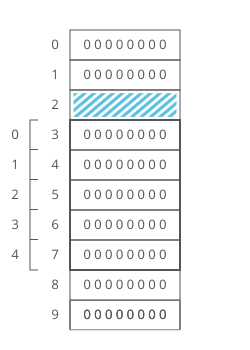
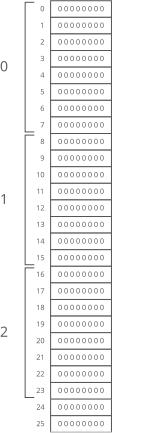
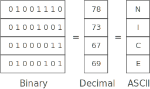
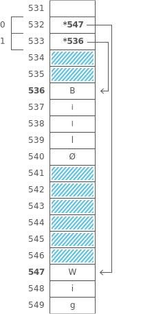
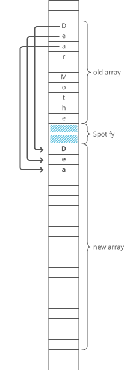
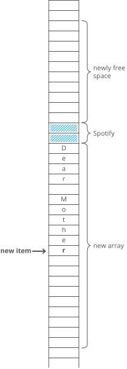

# Data Structures

## Random Access Memory (RAM)

Variables are stored in random access memory (RAM). We sometimes call RAM "working memory" or just "memory".

In addition to "memory," your computer has storage (sometimes called "persistent storage" or "disk"). Storage is where we keep files like mp3s, videos, Word documents, and even executable programs or apps.

Memory (or RAM) is faster but has less space, while storage (or "disk") is slower but has more space. A modern laptop might have ~500GB of storage but only ~16GB of RAM.


Think of RAM like a really tall bookcase with a lot of shelves. Like, billions of shelves. 

The shelves are numbered. We call a shelf's number its address. Each shelf has one byte (8 bits) of storage.

We also have a processor that does all the real work inside our computer. It's connected to a memory controller. 

The memory controller does the actual reading and writing to and from RAM. 

Even though the memory controller can jump between far-apart memory addresses quickly, programs tend to access memory that's nearby. So computers are tuned to get an extra speed boost when reading memory addresses that're close to each other by using cache which even faster than RAM. 

When the processor asks for the contents of a given memory address, the memory controller also sends the contents of a handful of nearby memory addresses. And the processor puts all of it in the cache.

## Binary numbers

The number system we usually use (the one you probably learned in elementary school) is called base 10 (decimal), because each digit has ten possible values (1, 2, 3, 4, 5, 6, 7, 8, 9, and 0).


But computers don't have digits with ten possible values. They have bits with two possible values. So they use base 2 numbers (binary).


So far we've been talking about unsigned integers. Here's how some other numbers could be stored:
- Fractions: Store two numbers: the numerator and the denominator.
- Decimals: Also two numbers: 1) the number with the decimal point taken out, and 2) the position where the decimal point goes (how many digits over from the leftmost digit).
- Negative Numbers: Reserve the leftmost bit for expressing the sign of the number. 0 for positive and 1 for negative.

## Fixed-width integers

The 256 possibilities we get with 1 byte are pretty limiting. So we usually use 4 or 8 bytes (32 or 64 bits) for storing integers.

- 32-bit integers have 2^32 possible values — more than 4 billion
- 64-bit integers have 2^64 possible values — more than 10 billion billion (10^19)

If we have a 64-bit fixed-length integer, it doesn't matter if that integer is 0 or 193,457 — it still takes up the same amount of space in RAM: 64 bits.

## Arrays

An array is a collection of items stored at **contiguous** memory locations. The idea is to store multiple items of the **same size** together. Looking up the contents of a given array index is O(1) time.

For example, we can store 5 8-bit integers in a single array variable.

```
nth item's memory address = address of array start + n
```



So how do we build an array of 64-bit (8 byte) integers on top of our 8-bit (1 byte) memory slots?

We simply give each array index 8 address slots instead of 1.

```
nth item's memory address = address of array start + (n * size of each item in bytes)
```



## Strings

A string is an array of characters. Each character is usually 1 byte (8 bits) long.



## Pointers

A pointer is a variable that stores the memory address of another variable.

Array of pointers is an array of memory addresses.

Advantages: 
- Items don't have to be the same length. Each item can be any size.
- We don't need enough uninterrupted free memory to store all items next to each other.

Tradeoffs:
- An array of pointers is not cache-friendly (but lookups in this array are still O(1))



## Dynamic arrays

A dynamic array is an array that can resize itself when it runs out of space.

When a dynamic array is full, it doesn't have enough contiguous free memory to store new items. So it has to move to a new, larger location in memory.





Advantages:
- You don't need to specify the size ahead of time.

Tradeoffs:
- Som appends can be expensive.

