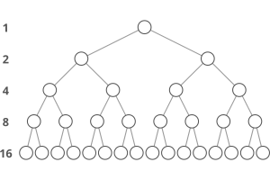

# Logarithms

## Introduction

Here's what a logarithm is asking: "What power must we raise this base to, in order to get this answer?"

For example, log(2)8 means what power must we raise 2 to in order to get 8, 2^x = 8? The answer is x = 3, because 2^3 = 8. So the logarithm of 8 with base 2 is 3, log(2)8 = 3.

## Usage

The main thing we use logarithms for is solving for x when x is in an exponent.

For example, if we have 2^x = 8, 

we can rewrite this as log(2)2^x = log(2)8, 

with log(2)2^x = x, so x = log(2)8, or x = 3.

That's how we use logarithms to pull a variable down from an exponent.

## Logarithm rules

Simplification: log(b)b^x = x. Useful for bringing a variable down from an exponent.

Multiplication: log(b)(m * n) = log(b)m + log(b)n

Division: log(b)(m / n) = log(b)m - log(b)n

Powers: log(b)m^n = n * log(b)m

Change of base: log(b)m = log(a)m / log(a)b. Useful for changing the base of a logarithm.

## Logarithm in search algorithms

"How many times must we double 1 before we get to n" is a question we often ask ourselves in computer science. Or, equivalently, "How many times must we divide n in half in order to get back down to 1?" (binary search)

The answer to both of these questions is log(2)n, or time complexity of binary search is O(log(2)n).

## Logarithm in sorting algorithms

Sorting algorithms in general like quicksort and mergesort have a time complexity of O(n log(n)).

The easiest way to see why is to look at merge sort. In merge sort, the idea is to divide the array in half, sort the two halves, and then merge the two sorted halves into one sorted whole. But how do we sort the two halves? Well, we divide them in half, sort them, and merge the sorted halves...and so on.

The log(2)n comes from the number of times we have to cut n in half to get down to subarrays of just 1 element (our base case). The additional n comes from the time cost of merging all n items together each time we merge two sorted subarrays.

## Logarithm in binary trees

The tree above is special because each "level" or "tier" of the tree is full. There aren't any gaps. We call such a tree "perfect."

One question we might ask is, if there are n nodes in total , what's the tree's height (h)? In other words, how many levels does the tree have?

That brings back our refrain, "how many times must we double 1 to get to n." But this time, we're not doubling 1 to get to n; n is the total number of nodes in the tree. We're doubling 1 until we get to . . . the number of nodes on the last level of the tree.

How many nodes does the last level have? It's: (n+1)/2

h = log(2)((n+1)/2) + 1, after simplification,

h = log(2)(n + 1) is the height of a binary tree with n nodes.

## Convension with base

- log n can be base 10 or 2 (in Big-O notation)
- lg n is base 2 (sometimes)
- ln n is base e
