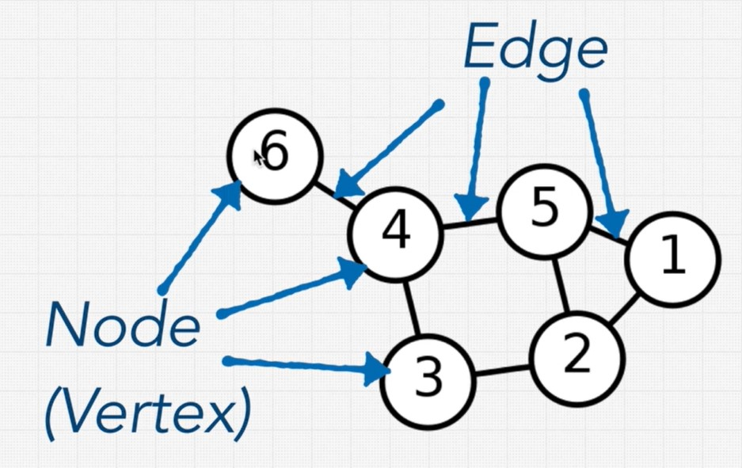
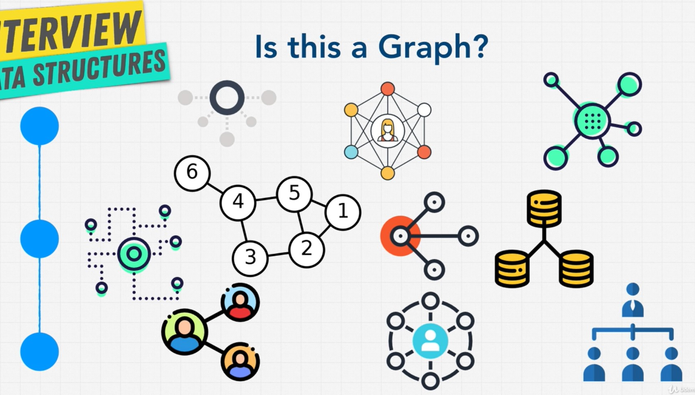
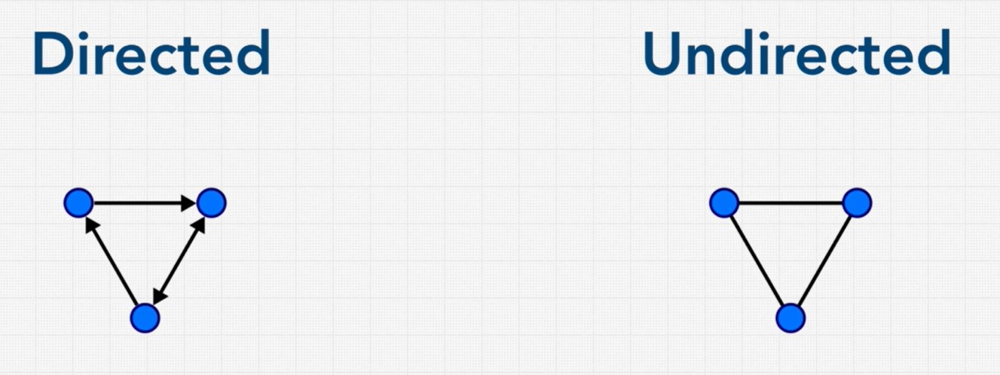
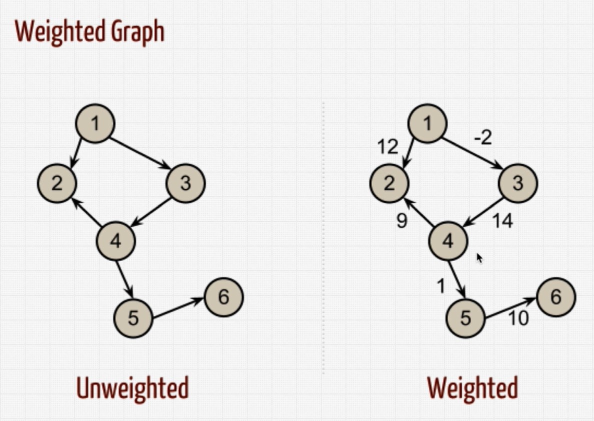
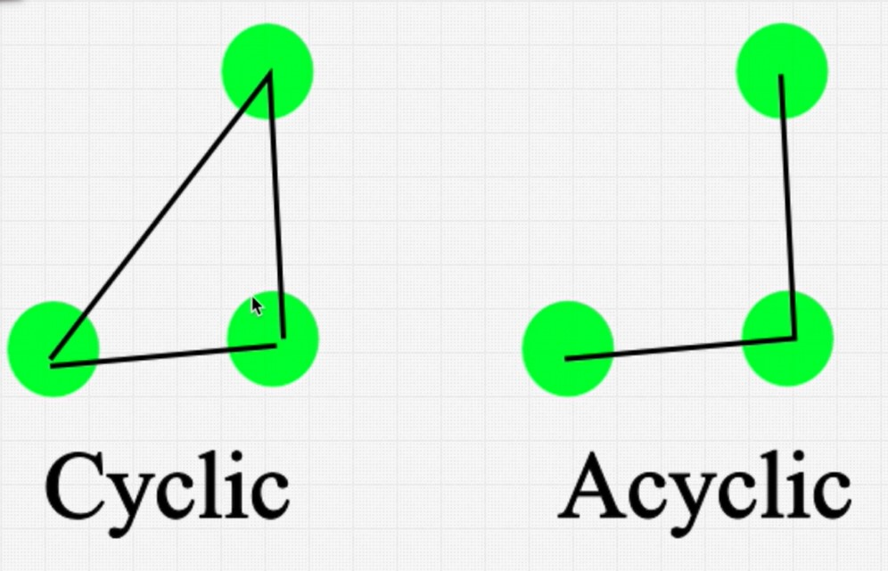
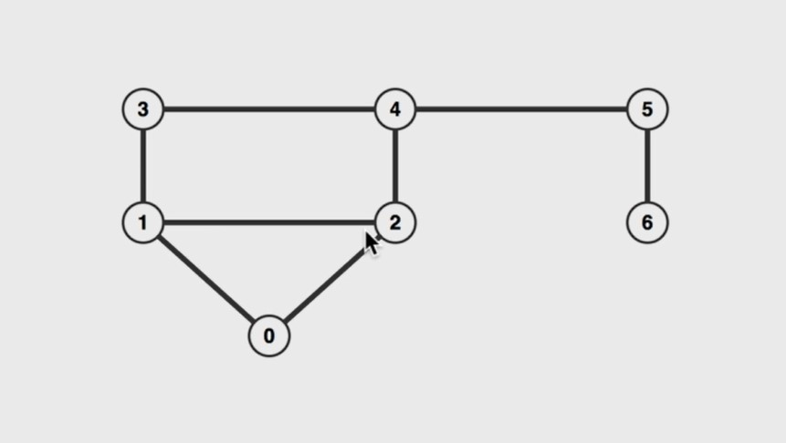
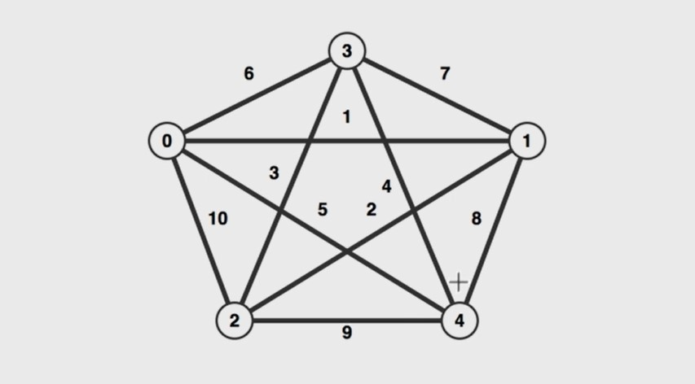
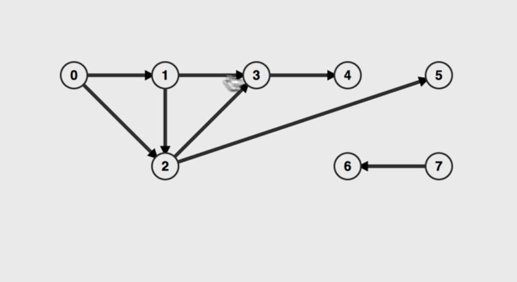
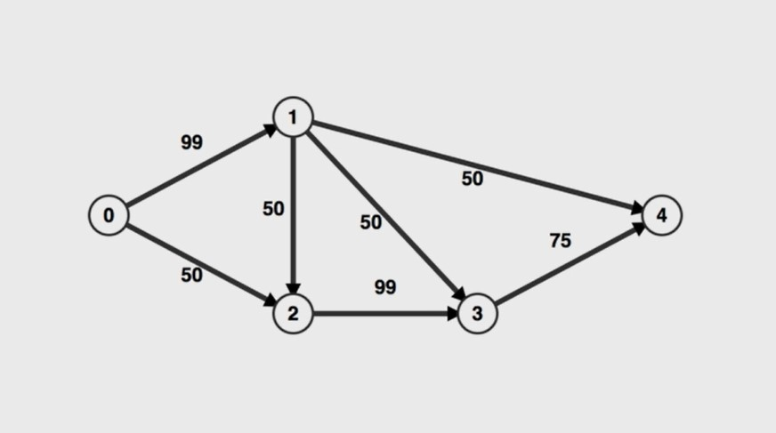
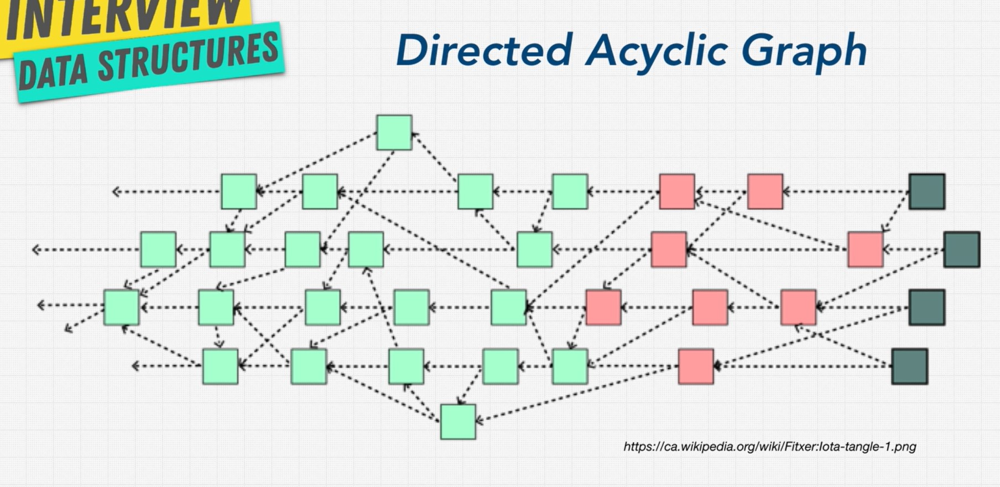

# Graphs

Pros:
- Relationships

Cons: 
- Scaling is hard

## Types of graphs

### Directed & undirected graphs

### Weighted & unweighted graphs

### Cyclic vs acyclic graphs

### Exercise guess the graphs

#### Undirected, unweighted, cyclic graph

#### Undirected, weighted, cyclic graph

#### Directed, unweighted, acyclic graph

#### Directed, weighted, acyclic graph

 
#### Directed acyclic graph
 

 

