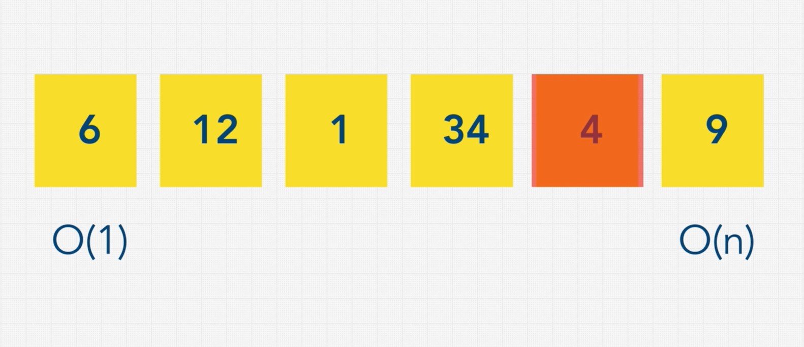
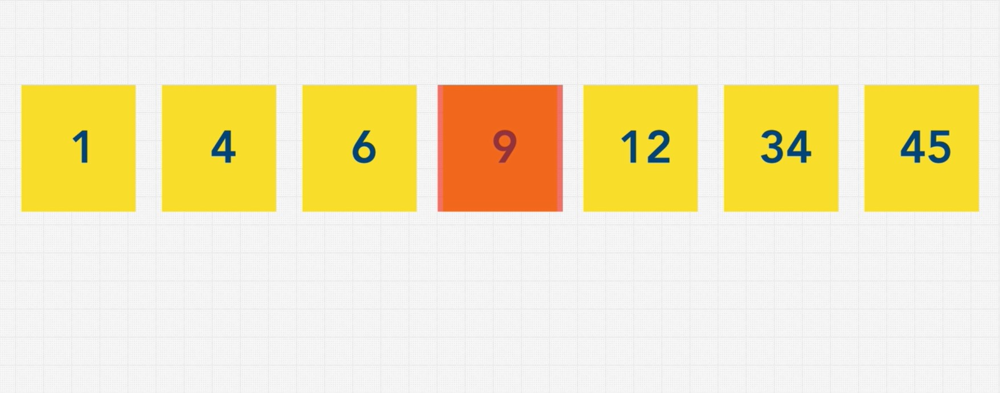
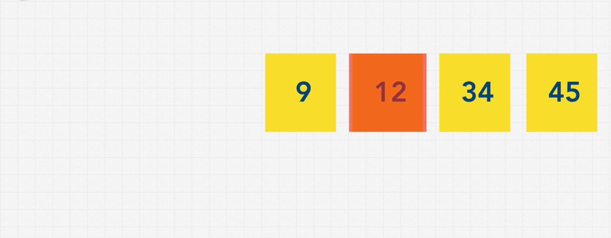
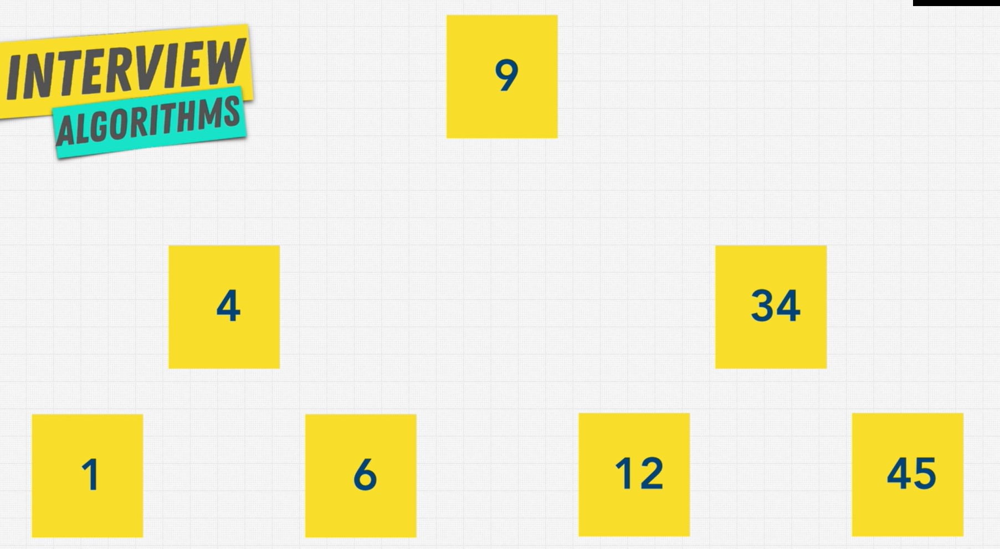

# Searching and traversal

## Linear search
BigO: O(n)



## Binary search (with sorted data)
BigO: O(log n)

We have to sort the list first (which also costs time)? 

=> we can store data as a tree data structure instead of a linear data structure (like an array).








## Breadth-first search (BFS)
Breadth-first search (BFS) is an algorithm for traversing or searching tree or graph data structures. It starts at the tree root node (selecting some arbitrary node as the root node in the case of a graph), and explores all of the neighbor nodes at the present depth prior to moving on to the nodes at the next depth level.

```markup
     9
  4     20
1  6  15  170

=> [9, 4, 20, 1, 6, 15, 170]
```

## Depth-first search (DFS)
Depth-first search (DFS) is an algorithm for traversing or searching tree or graph data structures. The algorithm starts at the root node (selecting some arbitrary node as the root node in the case of a graph) and explores as far as possible along each branch before backtracking.

```markup
     9
  4     20
1  6  15  170

=> [9, 4, 1, 6, 20, 15, 170]
```

## BFS vs DFS
*BFS and DFS are different with pre-order, in-order, and post-order in a binary search tree.*
### BFS
Pros:
- Good for finding "the shortest path"
- Find closer nodes (you know that the node you are finding is close to the root node)

Cons: 
- Use more memory

### DFS
Pros:
- Use less memmory
- Good for finding "does the path exist (from a source node to a target node)?"
- You know that the node you are finding is likely at the lower level of the tree 

Cons: 
- Can get slow in a very deep tree or graph

### When to use
1. If you know a solution is not far from the root of the tree:
    - BFS
2. If the tree is very deep and solutions are rare, 
    - BFS (DFS will take long time)
3. If the tree is very wide:
    - DFS (BFS will need too much memory)
4. If solutions are frequent but located deep in the tree
    - DFS
5. determining whether a path exists between two nodes
    - DFS
6. Finding the shortest path
    - BFS
