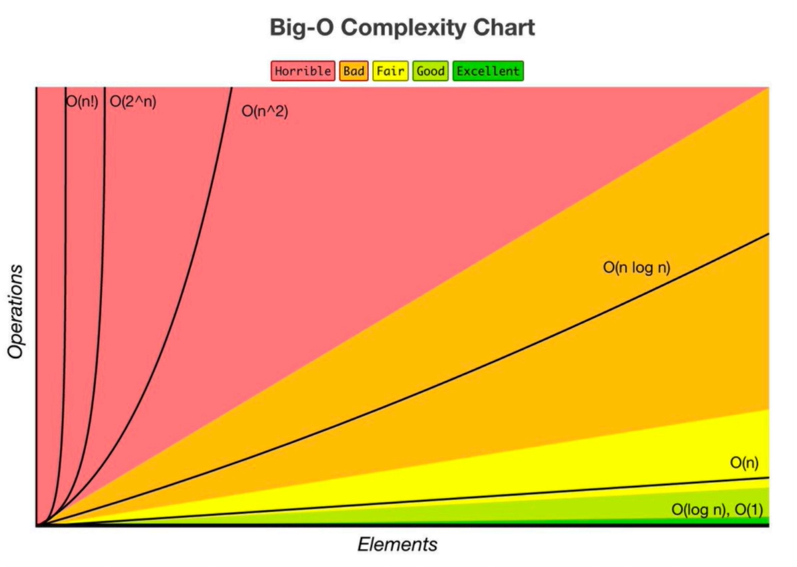

# Big O
How many steps the computer has to perfom for each function.



## O(n)
For loops, while loops.

Linear time, the big O depends on the number n (number of inputs).

```go
func findNemo(arr []string) { // O(n)
	for i:=0; i < len(arr); i++ {
		if arr[i] == "nemo" {
			fmt.Println("Found NEMO")
		}
	}
}
```


## O(1)
Constant time, the number of operations is the constant no matter how large the input is.

```go
func logFirstTwoElements(arr []string) {
	fmt.Println(arr[0])
	fmt.Println(arr[1])
}
```


## Analysis a simple funciton

```go
func funChallenge(input []int) {
	a := 10 // O(1)
	a = 50 + 3 // O(1)

	for i := 0; i < len(input); i++ { // O(n)
		anotherFunction() // O(n)
		let stranger = true // O(n)
		a++ // O(n)
	}

	return a // O(1)
}

// Big O(3 + 4n) => Big O(n)
```

## Big O rule 1: Worst case
Always think about the worst case.

## Big O rule 2: Remove constants
Remove constants.

## Big O rule 3: Different terms for inputs
```go
func compressBoxes(boxes1, boxes2 []int) {
	for i := 0; i < len(boxes1); i++ {
		fmt.Println(i)
	}
	
	for i := 0; i < len(boxes2); i++ {
		fmt.Println(i)
	}
}

// Big O(a+b)
```

## O(n^2)
2 nested loops.

Use multiplication for nested loops.

```go
func logAllPairsOfArr(arr []string) {
	for i := 0; i < len(arr); i++ {
		for j := 0; j < len(arr); j++ {
			fmt.Println(arr[i], arr[j])
		}
	}
}

// O(n*n) => O(n^2)
```

**Apply rule 3**

```go
func logAllPairsOfArr(arr1, arr2 []string) {
	for i := 0; i < len(arr1); i++ {
		for j := 0; j < len(arr2); j++ {
			fmt.Println(arr1[i], arr2[j])
		}
	}
}

// O(a*b)
```

## Big O rule 4: Drop Non Dominants

```go
func logAllElementsAndAllPairsOfArr(arr []string) {
	for i := 0; i < len(arr); i++ { // O(n)
		fmt.Println(arr[i])
	}

	for i := 0; i < len(arr); i++ { // O(n^2)
		for j := 0; j < len(arr); j++ {
			fmt.Println(arr[i], arr[j])
		}
	}
}

// O(n + n^2) => O(n^2)
```

## O(n!) (DONT write code have this complexity)

## Programming pillars


## Big O cheat sheet

### Big Os
- O(1) Constant - no loops
- O(log(n)) Logarithmic - usually searching have log(n) if they are sorted (binary search) (not on hash maps though)
- O(n) Linear - for loops, while loops
- O(n*log(n)) Log linear - sorting operations usually
- O(n^2) Quadratic - Two nested loops. Every element in a collection needs to be compared to ever other element.
- O(2^n) Exponential - recursive algorithms that solve a problem of size n
- O(n!) - You are adding a loop for every element.

*Iterating through half a collection is still O(n)*

*Two separate collections: O(a+b)*

### What can cause time in a function?
- Operations (+, -, *, /)
- Comparisions (<, >, ==)
- Looping (for, while)
- Outside function calls

### Rule book 
- Rule 1: Always worst case
- Rule 2: Remove constants
- Rule 3: Different inputs should have different variables. 
- Rule 4: Drop non-dominant terms

### What causes space complexity?
- Variables
- Data structures
- Function calls
- Allocations 
