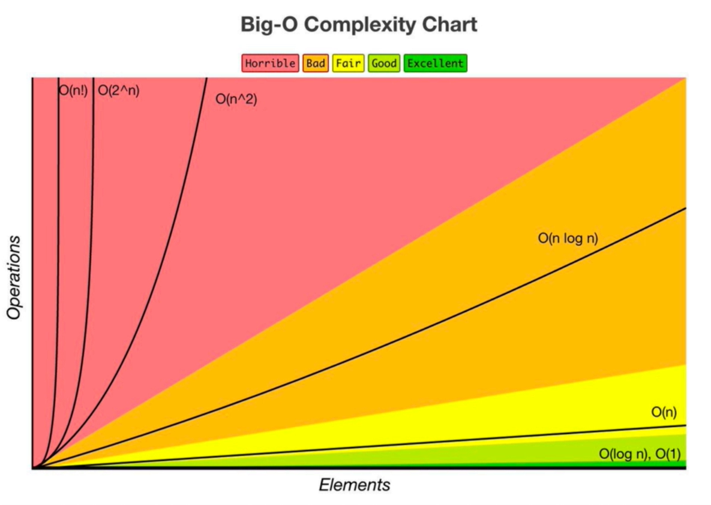
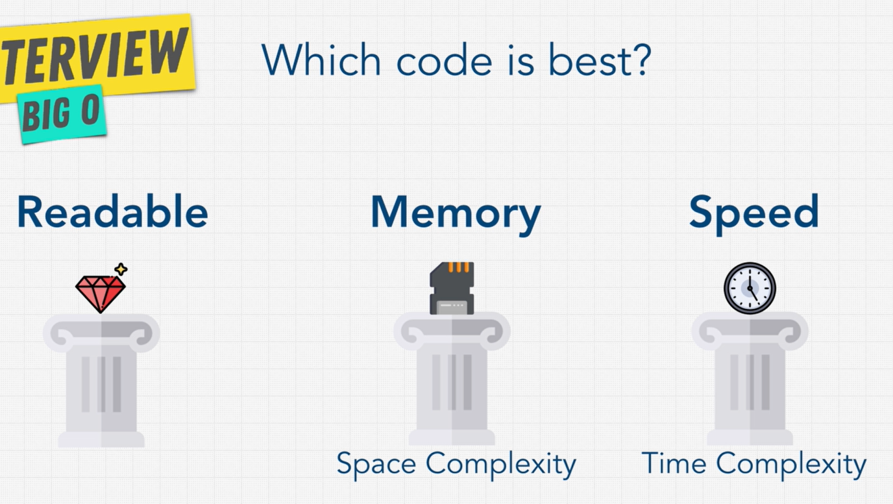

# Big O
How many steps the computer has to perfom for each function.

## The 3 pillars of good code

1. Readable
2. Time complexity
3. Space complexity

## Big Os
- O(1) Constant - no loops
- O(log(n)) Logarithmic - usually searching have log(n) if they are sorted (binary search) (not on hash maps though)
- O(n) Linear - for loops, while loops
- O(n*log(n)) Log linear - sorting operations usually
- O(n^2) Quadratic - Two nested loops. Every element in a collection needs to be compared to ever other element.
- O(2^n) Exponential - recursive algorithms that solve a problem of size n
- O(n!) - You are adding a loop for every element. (DONT write code have this complexity)

*Iterating through half a collection is still O(n)*

*Two separate collections: O(a+b)*

## What can cause time in a function?
- Operations (+, -, *, /)
- Comparisions (<, >, ==)
- Looping (for, while)
- Outside function calls

## Rule book 
- Rule 1: Always worst case
- Rule 2: Remove constants
- Rule 3: Different inputs should have different variables. 
- Rule 4: Drop non-dominant terms

## What causes space complexity?
- Variables
- Data structures
- Function calls
- Allocations 
