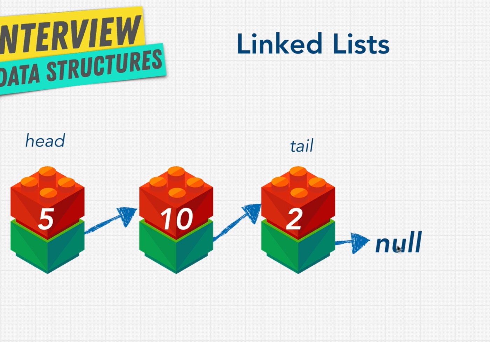

# Linked lists & Doubly linked lists
Fast insert, delete, items in linked list are ordered but not located right next to each other like array items.

## BigO
- prepend O(1)
- append O(1)
- lookup O(n)
- insert O(n) // most case faster than in an array
- delete O(n) // most case faster than in an array

## Single vs double linked list

Single linked list:
- Pros
    - Simple implementation
    - Require less memory
    - Delete, insert is a little bit faster
- Cons
    - Can not traverse from back to front
    - A little bit slower at seaching

Double linked list: 
- Pros
    - Can traverse from back to front
    - Can delete the previous node, do searching easier, faster
- Cons
    - Complex implementation
    - Require more memory
    - Delete, insert is a little bit slower
