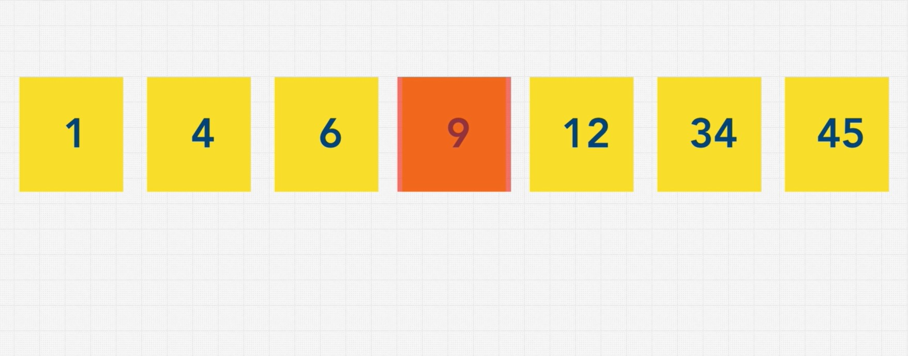
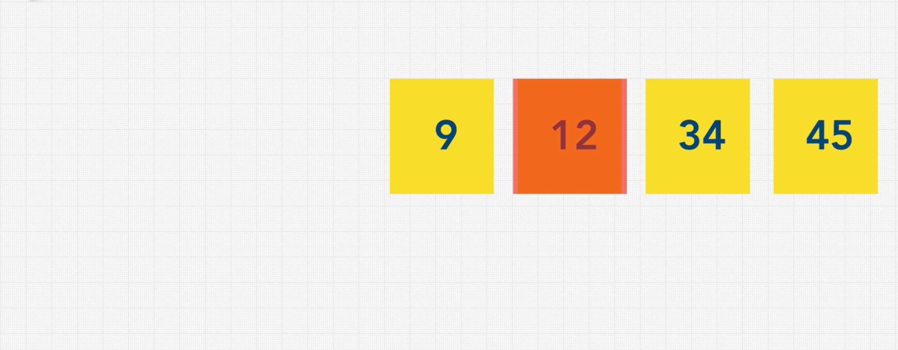
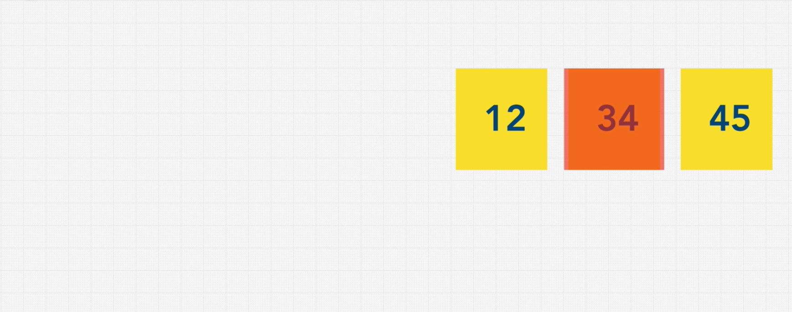
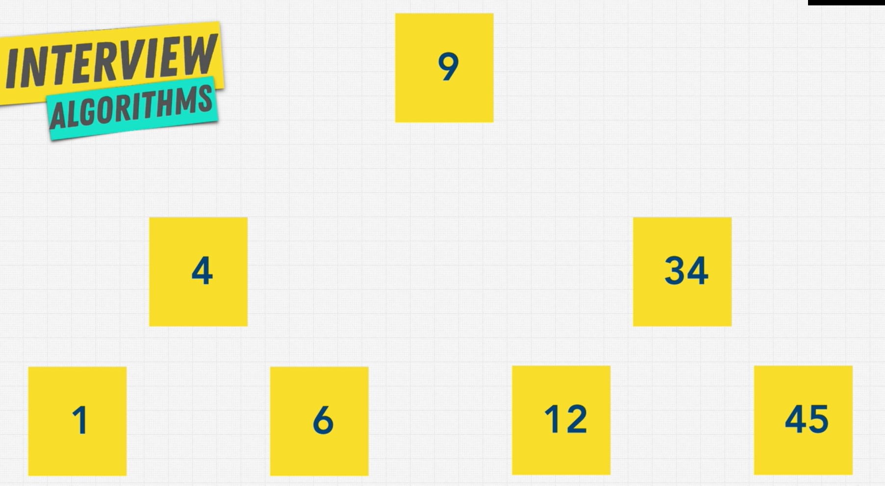

# Searching and traversal

## Linear search
BigO: O(n)

## Binary search (with sorted data)
BigO: O(log n)

We have to sort the list first (which also costs time)? 

=> we can store data as a tree data structure instead of a linear data structure (like an array).

