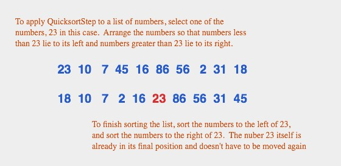

# Sorting
*built-in sort() in javascript convert all values into string first*

[Sorting Algorithms Animations](https://www.toptal.com/developers/sorting-algorithms)

## Bubble sort
Bubble Sort is the simplest sorting algorithm that works by repeatedly swapping the adjacent elements if they are in wrong order. Example: 

First Pass: 
```
( 5 1 4 2 8 ) –> ( 1 5 4 2 8 ), Here, algorithm compares the first two elements, and swaps since 5 > 1. 
( 1 5 4 2 8 ) –>  ( 1 4 5 2 8 ), Swap since 5 > 4 
( 1 4 5 2 8 ) –>  ( 1 4 2 5 8 ), Swap since 5 > 2 
( 1 4 2 5 8 ) –> ( 1 4 2 5 8 ), Now, since these elements are already in order (8 > 5), algorithm does not swap them.
```

Second Pass: 
```
( 1 4 2 5 8 ) –> ( 1 4 2 5 8 ) 
( 1 4 2 5 8 ) –> ( 1 2 4 5 8 ), Swap since 4 > 2 
( 1 2 4 5 8 ) –> ( 1 2 4 5 8 ) 
( 1 2 4 5 8 ) –>  ( 1 2 4 5 8 ) 
```

Now, the array is already sorted, but our algorithm does not know if it is completed. The algorithm needs one whole pass without any swap to know it is sorted.

Third Pass: 
```
( 1 2 4 5 8 ) –> ( 1 2 4 5 8 ) 
( 1 2 4 5 8 ) –> ( 1 2 4 5 8 ) 
( 1 2 4 5 8 ) –> ( 1 2 4 5 8 ) 
( 1 2 4 5 8 ) –> ( 1 2 4 5 8 ) 
```
## Selection sort
The selection sort algorithm sorts an array by repeatedly finding the minimum element (considering ascending order) from unsorted part and putting it at the beginning. The algorithm maintains two subarrays in a given array.

1) The subarray which is already sorted.
2) Remaining subarray which is unsorted.

In every iteration of selection sort, the minimum element (considering ascending order) from the unsorted subarray is picked and moved to the sorted subarray.

```
arr[] = 64 25 12 22 11

// Find the minimum element in arr[0...4]
// and place it at beginning
11 25 12 22 64

// Find the minimum element in arr[1...4]
// and place it at beginning of arr[1...4]
11 12 25 22 64

// Find the minimum element in arr[2...4]
// and place it at beginning of arr[2...4]
11 12 22 25 64

// Find the minimum element in arr[3...4]
// and place it at beginning of arr[3...4]
11 12 22 25 64 
```

## Insertion sort
Insertion sort is a simple sorting algorithm that works similar to the way you sort playing cards in your hands. The array is virtually split into a sorted and an unsorted part. Values from the unsorted part are picked and placed at the correct position in the sorted part.

To sort an array of size n in ascending order: 
```
1. Iterate from arr[1] to arr[n] over the array. 
2. Compare the current element (key) to its predecessor. 
3. If the key element is smaller than its predecessor, compare it to the elements before. Move the greater elements one position up to make space for the swapped element.
```


## Merge sort
Merge Sort is a Divide and Conquer algorithm. It divides the input array into two halves, calls itself for the two halves, and then merges the two sorted halves. The merge() function is used for merging two halves. The merge(arr, l, m, r) is a key process that assumes that arr[l..m] and arr[m+1..r] are sorted and merges the two sorted sub-arrays into one.


```
MergeSort(arr[], l,  r)
If r > l
    1. Find the middle point to divide the array into two halves:  
        middle m = l+ (r-l)/2
    2. Call mergeSort for first half:   
        Call mergeSort(arr, l, m)
    3. Call mergeSort for second half: 
        Call mergeSort(arr, m+1, r)
    4. Merge the two halves sorted in step 2 and 3:
        Call merge(arr, l, m, r)
```

The following diagram from wikipedia shows the complete merge sort process for an example array {38, 27, 43, 3, 9, 82, 10}. If we take a closer look at the diagram, we can see that the array is recursively divided into two halves till the size becomes 1. Once the size becomes 1, the merge processes come into action and start merging arrays back till the complete array is merged.


## Quick sort
The Quicksort algorithm is based on a simple but clever idea: Given a list of items, select any item from the list. This item is called the pivot. (In practice, I'll just use the first item in the list.) Move all the items that are smaller than the pivot to the beginning of the list, and move all the items that are larger than the pivot to the end of the list. Now, put the pivot between the two groups of items. This puts the pivot in the position that it will occupy in the final, completely sorted array. It will not have to be moved again. We'll refer to this procedure as QuicksortStep.




 