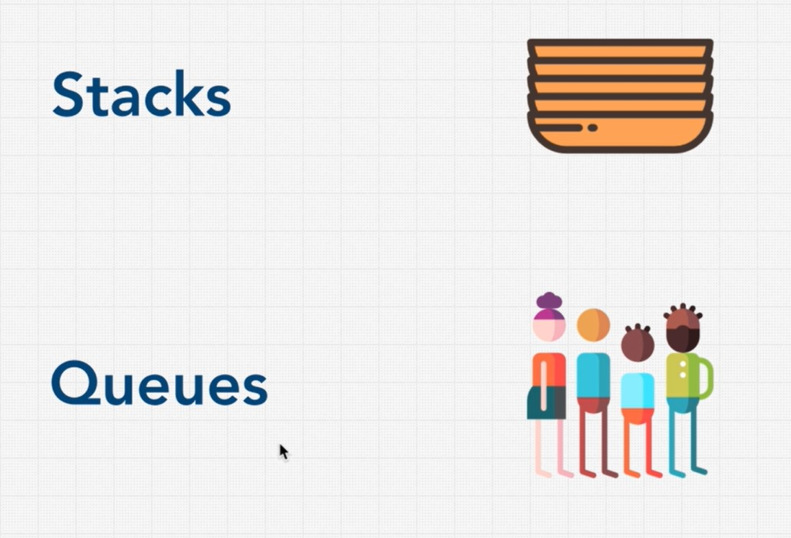
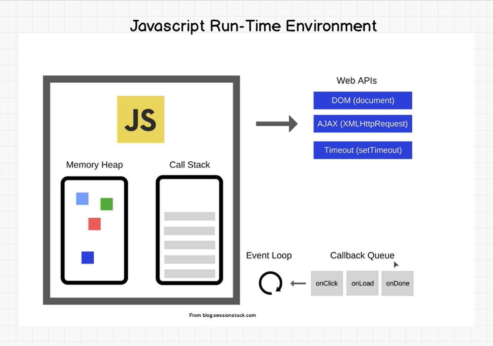

# Stacks and Queues
Linear data structure, process 1 item at a time.

## Stacks (LIFO)
Example, a function call get in another function calls, the last one will be call first, data structure for undo actions.

Implement with an array or a linked list are both ok. An array have a problem of double its size when reach the capacity, a linked list have a problem that it has to hold other information in each node.

### BigO
- Lookup O(n)
- Push O(1)
- Pop O(1) 
- Peek O(1) // returns the element at the top of the stack

## Queues (FIFO)
Example, a queue for waiting jobs in programming.

Implement with a linked list is ok, array implementation is inefficient as when delete the first item, we also need to re-order all other items.

### BigO
- Lookup O(n)
- enqueue O(1)
- dequeue O(1)
- Peek O(1) // returns the head of the queue