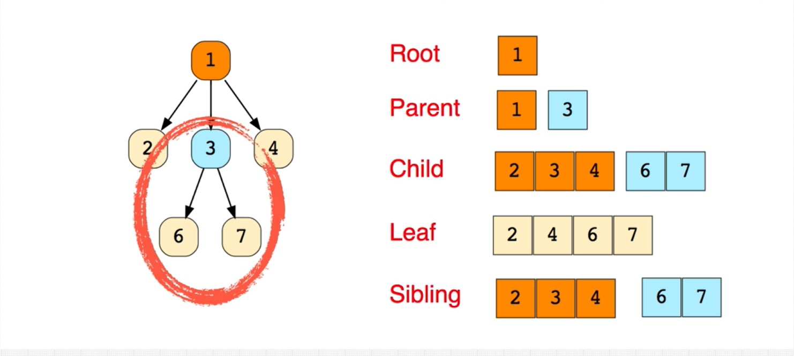
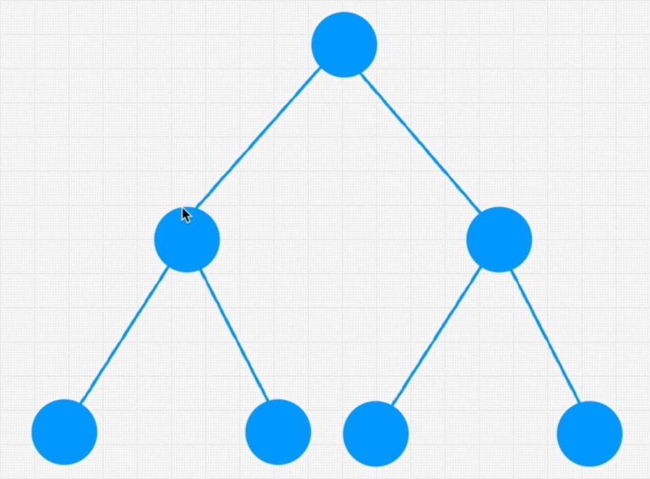
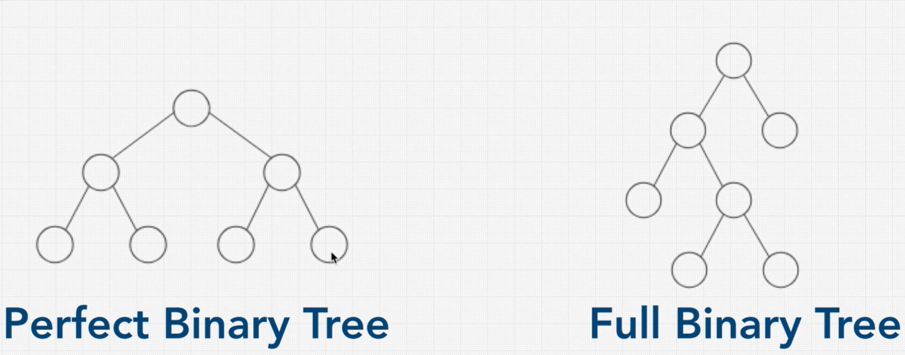
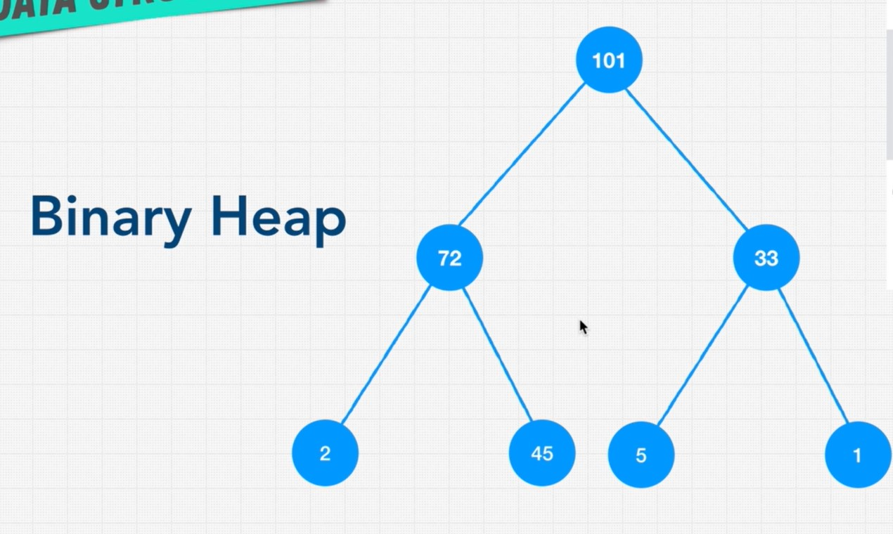
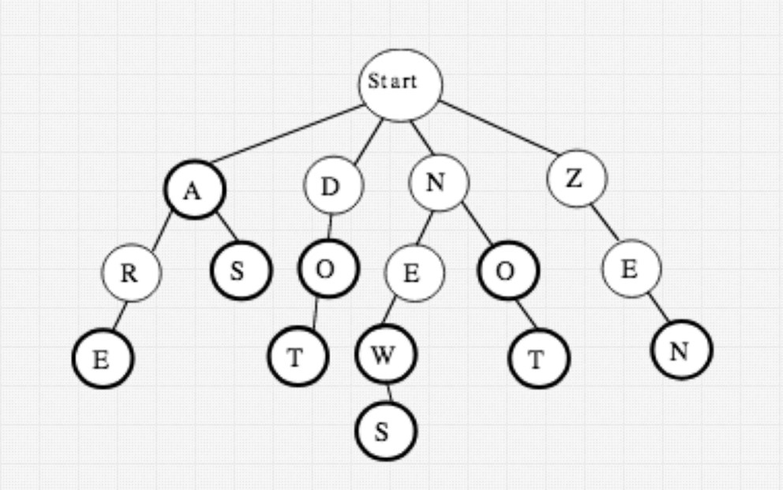

# Trees
Applications: DOM, abstract syntax tree in programming languages, Facebook comments,...



## Binary tree



### Perfect binary tree vs full binary tree



Perfect binary tree attributes:
- The number of total nodes on each level doubled as we move down the tree
- The number of nodes on the last level is equal to the sum of the number of nodes on the other levels plus one.
- The number of nodes on each level = 2^level - 1, the first level start from 1. For example: 2^1 - 1, 2^2 - 1, 2^3 - 1,...

## Binary search tree 
Properties:
- Each node has a distinguished key which is unique in the tree.
- A node can only have up to two children.
- Decrease on the left and increase on the right. The key of any node is greater than all keys occurring in its left subtree and less than all keys occurring in its right subtree.

Pros: 
- Ordered
- Fast searchings and lookups
- Better than O(n)
- Flexible size
- Better than hash tables because it has parent-children structure that preserves the relationships.

Cons:
- Searchings and lookups are inefficient on a very unbalanced binary search tree => O(n)
- No O(1) operations

### BigO
- Lookup O(log N)
- Insert O(log N) // have to search for where to insert item first
- Delete O(log N) // have to search for where to delete item first

```
// maxsteps is the max level of the tree
maxnodes = 2^maxsteps - 1 
<=> 2^maxsteps = maxnodes // drop -1
<=> maxsteps = log maxnodes // 10^2 = 100 <=> 2 = log 100
```

### AVL trees and Red black trees
Auto balanced binary search trees

## Binary heaps
A Binary Heap is a Binary Tree with following properties.
1. It’s a complete tree (All levels are completely filled except possibly the last level and the last level has all keys as left as possible). This property of Binary Heap makes them suitable to be stored in an array.
2. A Binary Heap is either Min Heap or Max Heap. In a Min Binary Heap, the key at root must be minimum among all keys present in Binary Heap. The same property must be recursively true for all nodes in Binary Tree. Max Binary Heap is similar to MinHeap.



BigO
- Lookup O(n)
- Insert O(log n)
- Delete O(log n)

A Binary heap can be used in any algorithms where ordering is important (priority queue).

### Priority queue


Pros:
- Better than O(n)
- Priority
- Flexible size
- Fast insert

Cons:
- Slow lookup

## Trie
Trie is an efficient information reTrieval data structure. Using Trie, search complexities can be brought to optimal limit (key length).



